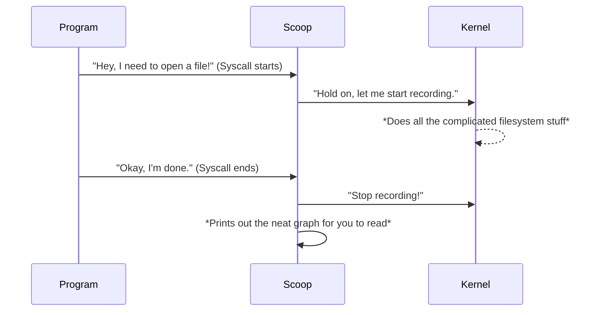

# 🍨 Scoop Tracer

Ever wondered what the Linux kernel is *actually* doing when you run a program? 

Scoop is a fun little tool that peeks under the hood for you. It pauses your program right before it talks to the kernel, records exactly what the kernel does in the background, and prints it out as a beautiful, easy-to-read tree.

## ⚙️ How it works



## 🚀 Try it out

**1. Build it**
```bash
make
sudo make install
```

**2. Trace something** (You need `sudo` because we are looking at real kernel memory!)
```bash
# Trace a standard command
sudo scoop ls

# Or trace your own code
sudo scoop ./my_program
```

## 🎥 Demo

*[Insert your awesome demo video here!]*
